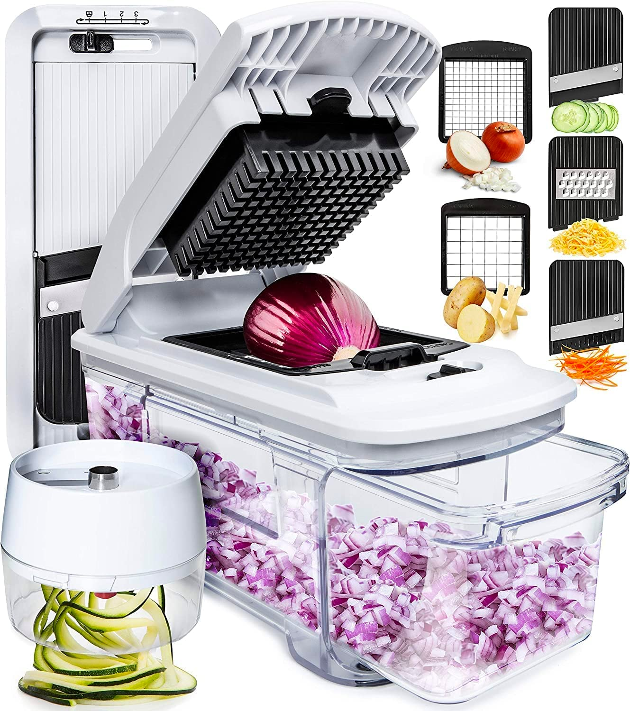

# E-Commerce Website
# Brand: "Kitchen Simply"


## About The Project

This is a capstone project for my Software Engineer Apprenticeship at Year Up. This project entails an E-Commerce Store for modern kitchen gadgets. The company I created is called "Kitchen Simply". I also designed the brand's logo. My website features six pages (Home, Register, Login, Products, Checkout, and Payment).

## Project Goals

- Create an intuitive flow for user experience.
- Simple, modern aesthetic.
- Provide an online store with checkout features.

### Built With

* HTML5
* CSS3
* Bootstrap
* JavaScript

### Requirements

1. A Home Page:
- Must have at least one stand-alone image
- Must have at least two paragraphs of text
- Must incorporate a bulleted or numbered list with at least 2 list items

2. A User Registration Page:
- Must have an HTML form with user name, password, password confirmation and email fields
- Must have a set of radio buttons with responses to the question "How did you hear about us?"
- Must include appropriate HTML validation attributes

3. A User Login Page:
- Must have an HTML form with user name and password fields
- Must have a remember me checkbox
- Must include appropriate HTML validation attributes

4. A Products and/or Services Page:
- Must list at least 6 products or services that are offered with a button that allows them to be ordered or added to a cart
- Each product/service must be described using a Bootstrap Card and each must contain an image

5. A Checkout Page:
- Must have an HTML form with appropriate input fields, a select field, and a submit button for purchaser information
- Input fields must include appropriate HTML validation attributes (ex: required, max length, etc.)
- Must contain an HTML table displaying at least 3 rows of sample data for items in the cart

### Interesting Piece of HTML/CSS

1. Hover Effect Over Gallery Images
2. In Pages > `product.html`:


  ```html
<div class="row">
<div class="col-xs-12 ProdCategory">
</div>
<div class="col-xs-6 col-md-3 GalleryBox">
<a href="item.html" title="see details"> </a>
  ```
  3. In Pages > `styles.css`:

  ```css

 .GalleryBox img {
     /* width: 330px;
     height: 305px; */
     margin-top: 20px;
     transition: 0.5s;
     padding: 10px;
     border-width:2px;
     border-style: solid;
     border-color: white;
     box-shadow: 0px 0px 15px 0px rgba(0, 0, 0, 0.55);  
 }
 
 .GalleryBox img:hover {
     filter: brightness(100%) saturate(120%) contrast(120%) ;
     border-color:purple;
      transition: 0.5s;
     transform: scale(1.01);
     
 }
  ```
  

  ## Screenshots of Webpages

  1. 


  2. 


  3. 


  4. 


  5. 

  
  6. 


## Contact

Your Name - @jenaecodes

Project Link: [https://github.com/jenaecodes/E-Commerce-Website]